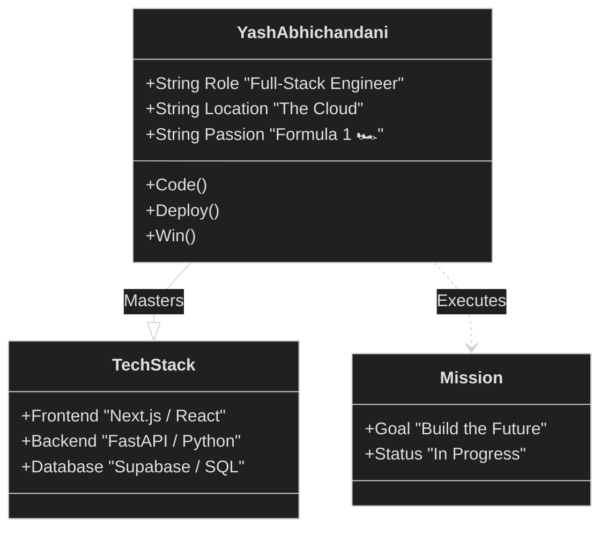
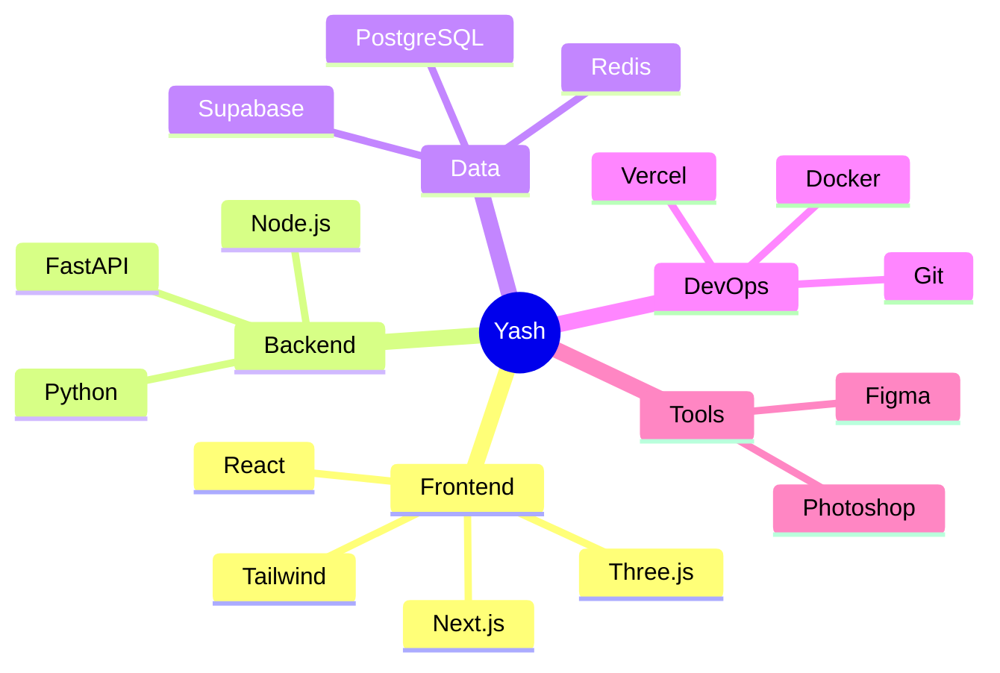
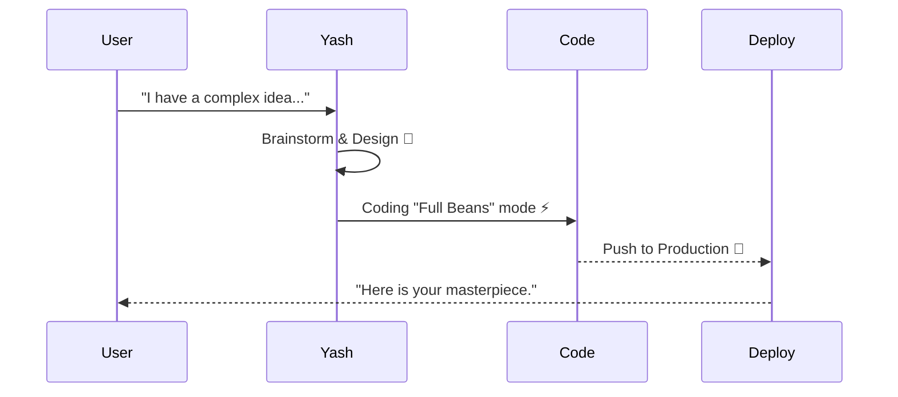

<div align="center">


</div>

<br />



<br />

<details>
<summary><b>📺 TERMINAL // ACCESS_BIO [Click to Expand]</b></summary>
<br/>

```bash
yash@mainframe:~$ whoami
> Yash Abhichandani. Full-Stack Developer. F1 Fanatic.
> I turn caffeine into fast, scalable code.

yash@mainframe:~$ cat current_status.json
{
  "focus": "F1-Predictor Vibe Project",
  "status": "Shipping",
  "mood": "Full Beans",
  "music": "Synthwave"
}

yash@mainframe:~$ ./contact.sh
> GitHub: @Abhichandani-Yash-Manish
> LinkedIn: Connected
> Email: yashraj2507@gmail.com
```

</details>

---

### 🧠 NEURAL NETWORK // SKILLS_TOPOLOGY



---

### 🚀 EXECUTION_PROTOCOL // WORKFLOW



---

### 📂 MISSION_LOGS // PROJECT_DATABASE

| ID | Mission Name | Class | Status | Access |
|:--:|:--|:--:|:--:|:--:|
| `001` | **F1 Predictor** | *Flagship* | `ACTIVE` 🟢 | [**[DEPLOY]**](https://apexpredict.live) |
| `002` | **System Portfolio** | *Identity* | `STABLE` 🔵 | [**[ROOT]**](https://github.com/Abhichandani-Yash-Manish) |
| `003` | **Secret Project** | *R&D* | `CLASSIFIED` 🔴 | `[DENIED]` |

---

### 📊 SYSTEM_LOAD // TELEMETRY

<div align="center">
  
  
</div>

<br/>

<div align="center">
  <code> END_OF_TRANSMISSION // 2026 </code>
</div>
