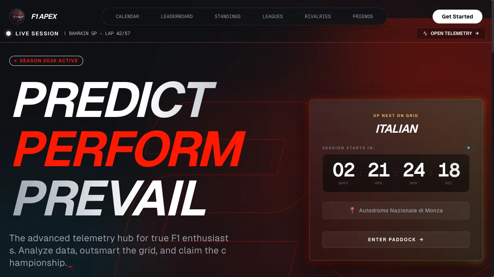
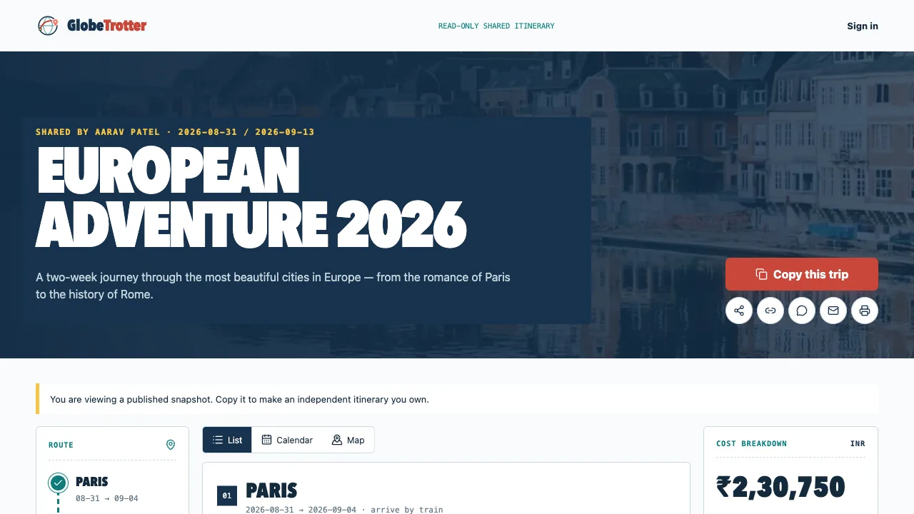
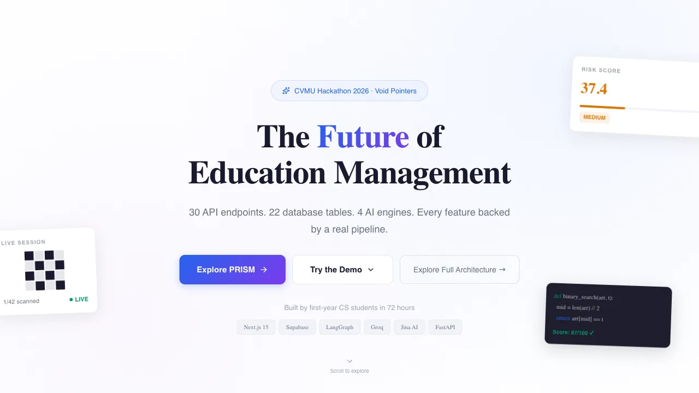

<div align="center">

[**Apex Predict**](https://apexpredict.live) &nbsp;·&nbsp; [**Repositories**](https://github.com/Abhichandani-Yash-Manish?tab=repositories) &nbsp;·&nbsp; [**LinkedIn**](https://in.linkedin.com/in/yash-abhichandani-dev) &nbsp;·&nbsp; [**Email**](mailto:yashraj2507@gmail.com)

</div>

I am happiest when the clock is running, the data is messy, and the system still has to work. That is probably why I like both **hackathons** and **Formula 1**.

I'm Yash — a Computer Engineering student at Dharmsinh Desai University and a BS Data Science student at IIT Madras, building from Gujarat, India.

---

## `01 / What I build`

I like ambitious ideas, but I care just as much about what makes them defensible: clean data, explicit boundaries, resilient fallbacks, and a demo that still runs on someone else's machine three months later.

```text
PRODUCT       TypeScript · React · Next.js · FastAPI
INTELLIGENCE  scikit-learn · LangGraph · RAG · evaluation design
DATA          PostgreSQL · Supabase · Turso · SQLite · pgvector
DELIVERY      Git · CI · Docker · Vercel · Playwright
```

---

## `02 / Selected work`

### `01` Apex Predict — race weekends, made competitive

<a href="https://apexpredict.live"></a>

A prediction game that turns a Formula 1 weekend into something friends compete over: qualifying and race picks, fastest-lap calls, private leagues, standings, and live session context in one command center.

`Next.js` · `TypeScript` · `FastAPI` · `Supabase` · `OpenF1`

**The decision that mattered.** Session deadlines and scoring are modeled as product logic — a pick locks against the real session clock — rather than as decoration over a generic fantasy-sports template. Get the lock wrong and every score in the league is meaningless, so the deadline is enforced server-side and never trusted from the client.

[**Live ↗**](https://apexpredict.live) · [**Source ↗**](https://github.com/Abhichandani-Yash-Manish/apex-predict)

<br>

### `02` Turnout Lab — the benchmark was the first bug

A leakage-aware attendance forecasting system that estimates turnout without pretending a compromised evaluation split is valid evidence.

`Python` · `scikit-learn` · `Streamlit` · `Plotly` · `SQLite` · `pytest`

**The decision that mattered.** All 100 records in the official test split overlapped the training data. Reporting against it would have produced a flattering, meaningless score. I quarantined every linked row before any modeling and re-derived all results from grouped, leakage-safe out-of-fold evaluation. The honest numbers are weaker — and they are the ones I publish.

| ROC-AUC | Macro-F1 | Brier | Brier skill |
|:--|:--|:--|:--|
| `0.635` | `0.584` | `0.221` | `+5.1%` |

397 leakage-safe rows · 25 outer folds across fixed seeds · fold-local preprocessing, calibration, and threshold selection

<details>
<summary><strong>Why the app separates confidence from reliability</strong></summary>

<br>

A calibrated probability is not the same claim as a trustworthy input. The dashboard reports the predicted attendance probability and the reliability of the record it came from as two separate signals, so a confident-looking number sourced from thin data cannot quietly pass as evidence. Student identifiers never enter the operational logs.

</details>

[**Case study + source ↗**](https://github.com/Abhichandani-Yash-Manish/turnout-lab)

<br>

### `03` GlobeTrotter — the trip survives the refresh

<a href="https://globetrotter-vert-ten.vercel.app/share/demo-europe-trip"></a>

A collaborative workspace that turns "two weeks in Europe" into a dated, costed itinerary someone else can open, edit, publish, and copy into their own plan.

`Next.js` · `TypeScript` · `Prisma` · `Turso` · `MapLibre` · `Playwright`

**The decision that mattered.** Coordinates are persisted, maps are keyless, and currency references are dated offline snapshots. A hackathon demo that depends on a live paid API is a demo with an expiry date — this one still opens for a judge, signed out, months after the event.

[**Live ↗**](https://globetrotter-vert-ten.vercel.app) · [**Published itinerary ↗**](https://globetrotter-vert-ten.vercel.app/share/demo-europe-trip) · [**Source ↗**](https://github.com/Abhichandani-Yash-Manish/GlobeTrotter)

<br>

### `04` PRISM IEMS — institutional signals, one operating view

<a href="https://prism-iems.vercel.app"></a>

An education-management system connecting academics, finance, infrastructure, and communication to an AI intelligence hub — skill-gap analysis, grading, retention risk, and complaint routing each handled by a distinct agent.

`Next.js 15` · `TypeScript` · `FastAPI` · `LangGraph` · `Supabase` · `pgvector` · `Groq`

**The decision that mattered.** Operational workflows and the agent layer run as separate services rather than one app calling an LLM inline. A slow or failing agent degrades the intelligence hub without taking attendance and fee collection down with it. Role boundaries are enforced by row-level security in the data layer, not by conditionals in the UI.

30 endpoints · 22 tables · 7+ distinct roles · built with Team Void Pointers for CVMU Hackathon 2026

[**Live ↗**](https://prism-iems.vercel.app) · [**Source ↗**](https://github.com/Abhichandani-Yash-Manish/prism-iems)

---

## `03 / Also built`

- [**PharmaGuard**](https://github.com/Abhichandani-Yash-Manish/pharmaguard) — FEFO-enforced dispensing, live expiry visibility, and four-week demand forecasting for pharmacy operations. `React` `Flask` `scikit-learn` `Firebase`
- [**BEOS+**](https://beos-plus.vercel.app) — blood inventory, emergency mapping, and donor alerts across four stakeholder portals. `React` `FastAPI` `Socket.IO` `Supabase` · [source ↗](https://github.com/Abhichandani-Yash-Manish/BEOS_PLUS)
- [**Cosmic Lens**](https://cosmiclens-iota.vercel.app) — a full-stack observatory surfacing high-redshift anomalies from public survey archives, with spectral-analysis views. `JavaScript` · [source ↗](https://github.com/Abhichandani-Yash-Manish/cosmic-lens)
- [**Apex Simulate**](https://github.com/Abhichandani-Yash-Manish/apex-simulate) — an F1 strategy lab: TimescaleDB telemetry lake, tyre-degradation models, ghost-race simulation. `Python` `FastAPI` `Redis`

---

## `04 / How I work`

Tools change. The loop does not:

```
audit the problem → design the contract → build the path → test the journey → show the evidence
```

| Build | My lane | What the work demonstrates |
|:--|:--|:--|
| **GlobeTrotter** · Odoo × LDCE Hackathon 2026 | Product and system build | Relational modeling, persistent collaboration, graceful degradation, a public journey verifiable without credentials |
| **PRISM IEMS** · CVMU Hackathon 2026 | Full-stack + agent layer | Service boundaries, multi-agent workflows, row-level security, role-aware dashboards |
| **PharmaGuard** · AETRIX 2026 | Team builder | Translating a healthcare-operations problem into FEFO inventory flows, forecasting, and a working interface |
| **Cosmic Lens** · DUHacks 5.0 | Backend architect | Shared architecture, API design, scientific-data presentation inside a three-person team |
| **Apex Simulate** | Independent lab | Breaking a large motorsport idea into telemetry storage, service boundaries, and modeling experiments |

I like teams with clear ownership, small testable interfaces, honest demos, and enough curiosity to ask what breaks after the happy path.

---

## `05 / Let's build something`

If you are building something where a polished interface needs a trustworthy system underneath — or you want a teammate for the next hackathon — I'd like to hear about it.

[**Email**](mailto:yashraj2507@gmail.com) &nbsp;·&nbsp; [**LinkedIn**](https://in.linkedin.com/in/yash-abhichandani-dev) &nbsp;·&nbsp; [**Repositories**](https://github.com/Abhichandani-Yash-Manish?tab=repositories)

<sub>Building from Gujarat, India. Usually thinking about software, systems, or the next race weekend.</sub>
