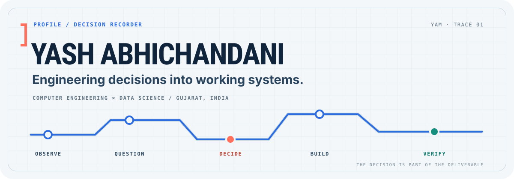

<picture>
  <source media="(prefers-color-scheme: dark)" srcset="./assets/decision-trace-dark.svg">
  <source media="(prefers-color-scheme: light)" srcset="./assets/decision-trace-light.svg">
  
</picture>

 

[Projects](https://github.com/Abhichandani-Yash-Manish?tab=repositories) · [GlobeTrotter live](https://globetrotter-vert-ten.vercel.app) · [LinkedIn](https://in.linkedin.com/in/yash-abhichandani-dev) · [Email](mailto:yashraj2507@gmail.com)

I am most interested in the moment when a project stops being a demo and starts having consequences: a leaked split can lie, an access rule can expose data, and a planner can lose someone's work. **That is the part I like engineering.**

I study Computer Engineering at Dharmsinh Desai University and Data Science at IIT Madras. My work moves between applied machine learning and full-stack product systems, but the method stays consistent:

> **Observe the signal. Question the convenient answer. Make the decision explicit. Build it. Verify the real journey.**

## Decision ledger

### Turnout Lab — when the benchmark was the bug

APPLIED ML · DATA INTEGRITY · DECISION SUPPORT

The obvious task was to train an attendance classifier. The important discovery was that **all 100 official test records also appeared in the training data** by student identity and normalized feature fingerprint. A conventional score could look perfect while measuring memorization.

- **Signal —** the official split produced suspiciously easy matching records.
- **Decision —** quarantine every test-linked identity and fingerprint before evaluation.
- **Build —** group-safe nested validation, fold-local preprocessing, sigmoid calibration, risk bands, batch scoring, and an operational Streamlit dashboard.
- **Proof —** 25 outer validation folds, machine-readable audit artifacts, an executed notebook, deterministic tests, and an explicit separation between evaluation and final prediction refit.

The result is deliberately honest: a calibrated random forest with modest signal, not a manufactured perfect score. The repository documents the trade-offs, limitations, privacy boundary, and prohibited punitive use.

**[Inspect the repository →](https://github.com/Abhichandani-Yash-Manish/turnout-lab)** &nbsp; **[Read the evaluation →](https://github.com/Abhichandani-Yash-Manish/turnout-lab#model-comparison-and-selection)**

---

### GlobeTrotter — a travel product that survives the demo

FULL-STACK PRODUCT · RELATIONAL WORKFLOWS · RESILIENT DEMO

GlobeTrotter turns a multi-city idea into a dated, costed itinerary that can be edited with collaborators, checked for planning conflicts, published, and copied into an independent trip.

- **Constraint —** keep the complete judged journey demonstrable without paid services or required API keys.
- **Decision —** use a durable relational model, seeded editorial data, keyless maps, persisted-coordinate route fallbacks, and clearly dated offline currency references.
- **Build —** role-aware collaboration, invitation tokens, 55 destination dossiers, 390 city-specific activities, budget controls, trip-health checks, multilingual navigation, and transactional trip copying.
- **Proof —** public demo journeys, desktop and mobile screenshots, database migrations, clean-data gates, access-control tests, deployment documentation, and a persistent Turso production path.

**[Open the live workspace →](https://globetrotter-vert-ten.vercel.app)** &nbsp; **[Inspect the repository →](https://github.com/Abhichandani-Yash-Manish/GlobeTrotter)**

## Selected systems

These are not interchangeable “project cards.” Each one explores a different system boundary.

- **PharmaGuard Gujarat —** FEFO pharmacy workflows, expiry visibility, demand forecasting, and inventory accountability. [Source](https://github.com/Abhichandani-Yash-Manish/Void-Pointers-Aetrix-2026-)
- **PRISM IEMS —** role-based institutional operations and agent-assisted education workflows. [Live](https://prism-iems.vercel.app) · [Source](https://github.com/Abhichandani-Yash-Manish/prism-iems)
- **BEOS+ —** emergency blood coordination across donors, hospitals, and blood banks. [Live](https://beos-plus.vercel.app) · [Source](https://github.com/Abhichandani-Yash-Manish/BEOS_PLUS)
- **F1 Apex —** deadline-aware motorsport predictions, leagues, scoring, and telemetry-oriented interfaces. [Live](https://apexpredict.live) · [Source](https://github.com/Abhichandani-Yash-Manish/F1-Prefictor-Vibe_Project)
- **Cosmic Lens —** scientific-data storytelling for high-redshift anomaly exploration in a team build. [Live](https://cosmiclens-iota.vercel.app) · [Source](https://github.com/Abhichandani-Yash-Manish/Cosmic-Lens-by-Team-Void_Pointers)

## Capability, with receipts

I prefer linking a capability to evidence instead of displaying a wall of logos.

- **Data before model.** Audit provenance, leakage, missingness, duplicates, and evaluation validity before optimizing a metric. [Turnout Lab audit](https://github.com/Abhichandani-Yash-Manish/turnout-lab#data-quality-audit)
- **Contracts before screens.** Define roles, state transitions, validation, persistence, and failure behavior before polishing the interface. [GlobeTrotter architecture](https://github.com/Abhichandani-Yash-Manish/GlobeTrotter#architecture)
- **Fallbacks before demos.** Make the core journey survive absent API keys, stale providers, refreshes, and clean installations. [GlobeTrotter verification](https://github.com/Abhichandani-Yash-Manish/GlobeTrotter#verification)
- **Uncertainty before certainty.** Separate a probability from reliability, show limitations, and avoid causal claims the data cannot support. [Turnout Lab model card](https://github.com/Abhichandani-Yash-Manish/turnout-lab#model-card-and-responsible-use)
- **Proof before claims.** Prefer runnable paths, screenshots, tests, artifacts, and explicit exclusions over feature-list theatre. [Repositories](https://github.com/Abhichandani-Yash-Manish?tab=repositories)

<strong>The tools behind the work</strong>

 

I reach for the tool that fits the boundary:

- **Product systems:** TypeScript, React, Next.js, relational data models, Supabase, Prisma, Turso, and Firebase.
- **APIs and workflows:** Python, FastAPI, Flask, LangGraph, background jobs, validation, and event-driven updates.
- **Applied ML:** pandas, scikit-learn, grouped validation, calibration, feature pipelines, diagnostics, and Streamlit.
- **Delivery:** Git, CI checks, Vercel, Docker, reproducible environments, seeded demos, and browser-level verification.

This list is intentionally secondary. The decision ledger above is the evidence.

## How I work with teams

Hackathons taught me to move quickly. The harder lesson was learning what must remain after the deadline: a repository someone else can run, an architecture someone else can explain, and limitations a reviewer does not have to discover by accident.

I am happiest in teams that:

- turn broad ideas into small, testable system boundaries;
- make ownership and handoffs explicit;
- keep the main journey runnable while features evolve;
- document why a decision was made, not only what was installed;
- treat the demo as the beginning of scrutiny, not the end of engineering.

## Current signal

Right now I am deepening three connected skills:

- leakage-safe and decision-aware machine learning;
- agent workflows with observable state and controlled side effects;
- full-stack products whose important journeys remain reproducible.

If you are building something in that territory—or want to turn an ambitious idea into a system people can actually inspect—let's talk.

**Yash Abhichandani** 
Gujarat, India · Computer Engineering × Data Science

[Email](mailto:yashraj2507@gmail.com) · [LinkedIn](https://in.linkedin.com/in/yash-abhichandani-dev) · [All repositories](https://github.com/Abhichandani-Yash-Manish?tab=repositories)

 

OBSERVE → QUESTION → DECIDE → BUILD → VERIFY

