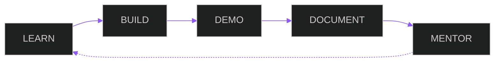

<div align="center">


<br />

<a href="https://apexpredict.live"></a>
<a href="https://prism-iems.vercel.app"></a>
<a href="https://in.linkedin.com/in/yash-abhichandani-dev"></a>

<br />
<br />

<samp>DUAL-DEGREE ENGINEER · FULL-STACK + AI · HACKATHON BUILDER · COMMUNITY-MINDED</samp>

</div>

---

## `01 / INITIALIZE`

```yaml
name: Yash Abhichandani
base: Gujarat, India
education:
  - Computer Engineering @ Dharmsinh Desai University
  - BS in Data Science @ IIT Madras
operating_mode:
  build: useful products
  explore: local LLMs, LangGraph, applied ML
  collaborate: hackathons and fast-moving teams
  share: clear demos, documentation, and learnings
current_signal: "Turning ambitious ideas into systems people can actually use"
```

I work where **product engineering, applied intelligence, and visual storytelling** meet. I like starting with a real problem, mapping the system, building the interface and backend, and pushing the result far enough that people can experience it—not just read about it.

My repositories are a focused set of **complete systems, deployed experiments, and team projects**—each one is a snapshot of how I think, architect, and ship.

---

## `02 / PROJECT_CONTROL_ROOM`

<table>
<tr>
<td width="50%" valign="top">
<h3>💎 PRISM IEMS</h3>
<p><strong>AI-assisted education operations</strong></p>
<p>A seven-role institutional system combining academics, finance, infrastructure, communication, and an AI intelligence hub.</p>
<p><code>Next.js 15</code> <code>TypeScript</code> <code>FastAPI</code> <code>LangGraph</code> <code>Supabase</code> <code>pgvector</code></p>
<p><strong>Technical signal:</strong> multi-agent workflows, RLS, realtime data, role-specific dashboards, typed validation.</p>
<p><a href="https://prism-iems.vercel.app"><strong>LIVE SYSTEM ↗</strong></a> · <a href="https://github.com/Abhichandani-Yash-Manish/prism-iems"><strong>SOURCE ↗</strong></a></p>
</td>
<td width="50%" valign="top">
<h3>💊 PharmaGuard Gujarat</h3>
<p><strong>Public-impact pharmacy intelligence</strong></p>
<p>An AETRIX 2026 build designed to reduce medicine waste using FEFO-enforced dispensing, live expiry alerts, and four-week demand forecasting.</p>
<p><code>React</code> <code>TypeScript</code> <code>Flask</code> <code>scikit-learn</code> <code>Firebase</code></p>
<p><strong>Technical signal:</strong> role-based access, realtime Firestore listeners, linear-regression forecasts, PDF reporting.</p>
<p><a href="https://github.com/Abhichandani-Yash-Manish/Void-Pointers-Aetrix-2026-"><strong>SOURCE &amp; CASE STUDY ↗</strong></a></p>
</td>
</tr>
<tr>
<td width="50%" valign="top">
<h3>🩸 BEOS+</h3>
<p><strong>Blood Emergency Operating System</strong></p>
<p>A coordination layer connecting hospitals, blood banks, and donors through live emergency mapping, inventory intelligence, and instant alerts.</p>
<p><code>React</code> <code>FastAPI</code> <code>Socket.IO</code> <code>Supabase</code> <code>Leaflet</code></p>
<p><strong>Technical signal:</strong> event-driven updates, geospatial UI, batch-expiry tracking, four stakeholder portals.</p>
<p><a href="https://beos-plus.vercel.app"><strong>LIVE SYSTEM ↗</strong></a> · <a href="https://github.com/Abhichandani-Yash-Manish/BEOS_PLUS"><strong>SOURCE ↗</strong></a></p>
</td>
<td width="50%" valign="top">
<h3>🏎️ F1 Apex</h3>
<p><strong>Formula 1 prediction command center</strong></p>
<p>A race-weekend experience for predictions, leagues, rivalries, performance analytics, and telemetry-driven exploration.</p>
<p><code>Next.js</code> <code>TypeScript</code> <code>FastAPI</code> <code>PostgreSQL</code> <code>OpenF1</code></p>
<p><strong>Technical signal:</strong> deadline-aware predictions, scoring logic, realtime experiences, telemetry visualization.</p>
<p><a href="https://apexpredict.live"><strong>LIGHTS OUT ↗</strong></a> · <a href="https://github.com/Abhichandani-Yash-Manish/F1-Prefictor-Vibe_Project"><strong>SOURCE ↗</strong></a></p>
</td>
</tr>
</table>

---

## `03 / ENGINEERING_MATRIX`

<div align="center">

<p><strong>Languages &amp; Interfaces</strong></p>


<p><strong>Services, Data &amp; Delivery</strong></p>


<br />
<br />


</div>

```text
                         ┌─ React / Next.js / motion-rich interfaces
PROBLEM → PRODUCT MAP ───┼─ FastAPI / Flask / service boundaries
                         ├─ Supabase / PostgreSQL / Firebase / realtime data
                         ├─ LangGraph / local LLMs / applied ML
                         └─ Docker / Vercel / deployed products → USERS
```

---

## `04 / TEAM_FLIGHT_LOG`

| Mission | Role signal | What the build demonstrates |
|:--|:--|:--|
| **PharmaGuard · AETRIX 2026** | Team builder | Problem research → ML-backed healthcare workflow → working system |
| **Cosmic Lens · DUHacks 5.0** | Backend Architect | Team architecture, API thinking, scientific-data storytelling |
| **Team Void Pointers** | Hackathon leadership | Fast scoping, responsibility under pressure, collaborative execution |
| **Apex Simulate** | Technical lab | TimescaleDB telemetry, FastAPI services, Redis events, ML strategy experiments |

<p align="center">
  <a href="https://cosmiclens-iota.vercel.app"><strong>EXPLORE COSMIC LENS ↗</strong></a>
  &nbsp;·&nbsp;
  <a href="https://github.com/Abhichandani-Yash-Manish/apex-simulate"><strong>OPEN THE STRATEGY LAB ↗</strong></a>
</p>

---

## `05 / COMMUNITY_PROTOCOL`

Great developer communities do more than host talks. They create a repeatable path from curiosity to confidence:


```mermaid
%%{init: {'theme': 'dark', 'themeVariables': {'primaryColor': '#0B1220', 'primaryTextColor': '#FFFFFF', 'primaryBorderColor': '#00E5FF', 'lineColor': '#8B5CF6', 'secondaryColor': '#111827', 'tertiaryColor': '#0B1220'}}}%%
flowchart LR
    A["LEARN"] --> B["BUILD"]
    B --> C["DEMO"]
    C --> D["DOCUMENT"]
    D --> E["MENTOR"]
    E -.-> A
```

What I want to bring to a campus developer community:

- **Project-first sessions** where every concept ends in something runnable.
- **Beginner-safe entry points**: setup guides, starter issues, and clear pathways to contribute.
- **Build squads** that carry ideas beyond a one-day event into documented, demoable projects.
- **Technical storytelling** that makes AI, web systems, Firebase, cloud tools, and open source approachable.
- **A culture of shipping and sharing**—because the best learning compounds when it moves through a community.

> **My community thesis:** lower the barrier to starting, raise the standard for finishing, and make the learning visible.

---

## `06 / OPEN_CHANNEL`

<div align="center">

### Let's build something people remember.

<a href="mailto:yashraj2507@gmail.com"></a>
<a href="https://in.linkedin.com/in/yash-abhichandani-dev"></a>
<a href="https://github.com/Abhichandani-Yash-Manish?tab=repositories"></a>

<br />
<br />

<samp>STATUS: BUILDING &nbsp; // &nbsp; FUEL: SYNTHWAVE &nbsp; // &nbsp; NEXT LAP: BETTER THAN THE LAST</samp>

</div>
