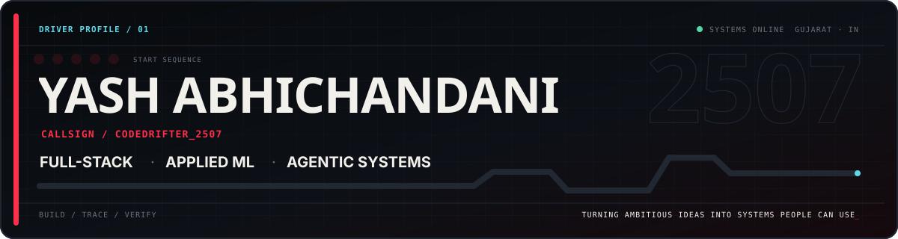
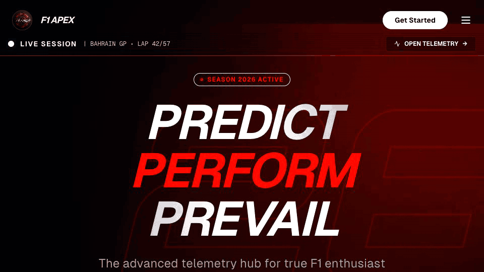
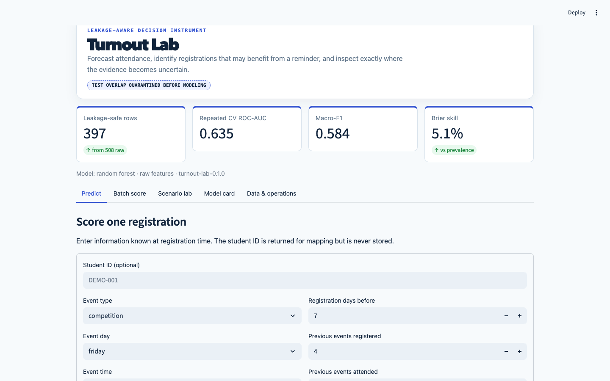
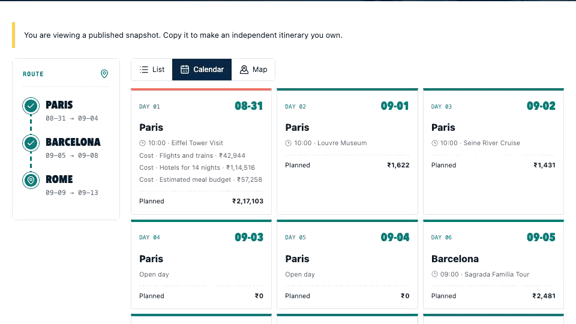

<div align="center">



<br>

[**F1 APEX**](https://apexpredict.live) &nbsp;·&nbsp; [**PROJECTS**](https://github.com/Abhichandani-Yash-Manish?tab=repositories) &nbsp;·&nbsp; [**LINKEDIN**](https://in.linkedin.com/in/yash-abhichandani-dev) &nbsp;·&nbsp; [**EMAIL**](mailto:yashraj2507@gmail.com)

</div>

I am happiest when the clock is running, the data is messy, and the system still has to work. That is probably why I like both **hackathons** and **Formula 1**.

I am **Yash**—a Computer Engineering student at Dharmsinh Desai University and a Data Science student at IIT Madras. I work where product engineering, applied intelligence, and visual storytelling meet. I like ambitious ideas, but I care just as much about what makes them defensible: clean data, explicit boundaries, resilient fallbacks, and a demo that actually runs.

---

## `01 / INITIALIZE`

```yaml
name: Yash Abhichandani
callsign: CodeDrifter_2507
base: Gujarat, India
education:
  - Computer Engineering @ Dharmsinh Desai University
  - BS in Data Science @ IIT Madras
operating_mode:
  build: full-stack products people can use
  investigate: data quality, failure modes, system boundaries
  explore: applied ML, RAG, agentic workflows, motorsport software
  ship: runnable repositories, honest demos, visible evidence
current_signal: "Turning ambitious ideas into systems people can use"
```

---

## `02 / FEATURED BUILDS`

### `01` F1 Apex — race weekend, made social

<a href="https://apexpredict.live">
  <picture>
    <source media="(prefers-reduced-motion: reduce)" srcset="./assets/previews/f1-apex-static.png">
    
  </picture>
</a>

A prediction game for turning Formula 1 weekends into something friends can compete over—picks, private leagues, scoring, deadlines, rivalries, and telemetry in one command center.

`Next.js` · `TypeScript` · `FastAPI` · `Supabase` · `OpenF1`

**Engineering decision.** Session deadlines and scoring rules are treated as product logic, not as decoration around a generic fantasy interface.

[**Live product ↗**](https://apexpredict.live) · [**Source ↗**](https://github.com/Abhichandani-Yash-Manish/F1-Prefictor-Vibe_Project)

<details>
<summary><strong>Engineering debrief</strong></summary>

The system models qualifying and race predictions, fastest-lap picks, global and private leagues, standings, notifications, and race-session context. The interface borrows motorsport's information density without copying official Formula 1 or team branding; the project is clearly presented as an unofficial fan build.

</details>

<br>

### `02` Turnout Lab — the benchmark was the first bug

<a href="https://github.com/Abhichandani-Yash-Manish/turnout-lab">
  
</a>

A leakage-aware attendance forecasting system that estimates turnout without pretending a compromised official split is valid evidence.

`Python` · `scikit-learn` · `Streamlit` · `Plotly` · `SQLite` · `pytest`

**Engineering decision.** All 100 official test records overlapped training, so their linked rows were quarantined before any modeling and every reported score came from grouped, leakage-safe out-of-fold evaluation.

[**Case study + source ↗**](https://github.com/Abhichandani-Yash-Manish/turnout-lab)

<details>
<summary><strong>Engineering debrief</strong></summary>

The final development cohort contains 397 leakage-safe rows. Model selection uses 25 outer folds across fixed seeds with fold-local preprocessing, calibration, and threshold selection. The resulting random forest reports ROC-AUC `0.635`, Macro-F1 `0.584`, Brier score `0.221`, and Brier skill `+5.1%`—modest signal, measured honestly. The app separates prediction probability from input reliability and never stores student identifiers in its operational logs.

</details>

<br>

### `03` GlobeTrotter — the trip survives the refresh

<a href="https://globetrotter-vert-ten.vercel.app/share/demo-europe-trip">
  <picture>
    <source media="(prefers-reduced-motion: reduce)" srcset="./assets/previews/globetrotter-static.png">
    
  </picture>
</a>

A collaborative workspace that turns a multi-city idea into a dated, costed itinerary someone can edit, review, publish, and copy into their own plan.

`Next.js` · `TypeScript` · `Prisma` · `Turso` · `MapLibre` · `Playwright`

**Engineering decision.** Persisted coordinates, keyless maps, and dated offline currency references keep the core journey demonstrable when paid services or API keys are unavailable.

[**Live product ↗**](https://globetrotter-vert-ten.vercel.app) · [**Published itinerary ↗**](https://globetrotter-vert-ten.vercel.app/share/demo-europe-trip) · [**Source ↗**](https://github.com/Abhichandani-Yash-Manish/GlobeTrotter)

<details>
<summary><strong>Engineering debrief</strong></summary>

GlobeTrotter combines role-aware collaboration, hashed invitation links, transactional trip copying, itinerary health checks, budget controls, responsive list/calendar/map views, and persistent SQLite/Turso storage. Its seeded path includes 55 destination dossiers and 390 distinct activities, while the verification gate covers data quality, permissions, fallbacks, builds, and browser journeys.

</details>

<br>

### `04` PRISM IEMS — institutional signals, one operating view

<a href="https://prism-iems.vercel.app">
  
</a>

An integrated education-management system connecting academic operations, finance, infrastructure, communication, and an AI-assisted intelligence hub.

`Next.js` · `TypeScript` · `FastAPI` · `LangGraph` · `Supabase` · `pgvector`

**Engineering decision.** Operational workflows and the agent layer are separated across the Next.js application and FastAPI service, while role boundaries and row-level security remain explicit in the data layer.

[**Live system ↗**](https://prism-iems.vercel.app) · [**Source ↗**](https://github.com/Abhichandani-Yash-Manish/prism-iems)

<details>
<summary><strong>Engineering debrief</strong></summary>

The Intelligence Hub gives distinct jobs to skill-gap analysis, grading, retention-risk, and complaint-routing agents. More than seven institutional roles receive different dashboards and permissions, while the operational suites cover attendance, results, fees, hostel and library workflows, notices, and complaints.

</details>

---

## `03 / ENGINEERING TELEMETRY`

```text
PRODUCT       TypeScript · React · Next.js · FastAPI
INTELLIGENCE  scikit-learn · LangGraph · RAG · evaluation
DATA          PostgreSQL · SQLite · Supabase · Turso
DELIVERY      Git · CI · Docker · Vercel · browser QA
```

Tools change. My loop does not: **audit the problem → design the contract → build the path → test the journey → show the evidence**.

---

## `04 / GARAGE`

- [**PharmaGuard**](https://github.com/Abhichandani-Yash-Manish/Void-Pointers-Aetrix-2026-) — FEFO dispensing, expiry visibility, four-week demand forecasting, and role-aware pharmacy operations.
- [**BEOS+**](https://beos-plus.vercel.app) — blood inventory, emergency mapping, donor alerts, and separate hospital, blood-bank, donor, and admin workflows. [Source ↗](https://github.com/Abhichandani-Yash-Manish/BEOS_PLUS)
- [**Cosmic Lens**](https://cosmiclens-iota.vercel.app) — scientific archives, spectral-analysis interfaces, visual explanations, and astronomy storytelling. [Source ↗](https://github.com/Abhichandani-Yash-Manish/Cosmic-Lens-by-Team-Void_Pointers)
- [**Apex Simulate**](https://github.com/Abhichandani-Yash-Manish/apex-simulate) — a containerized strategy and telemetry lab exploring FastAPI, TimescaleDB, Redis, and stint-level ML experiments.

---

## `05 / TEAM FLIGHT LOG`

| Build | My lane | What the work demonstrates |
|:--|:--|:--|
| **GlobeTrotter · Odoo × LDCE Hackathon 2026** | Product and system build | Relational modeling, persistent collaboration, graceful degradation, and a public journey that can be verified without credentials. |
| **PharmaGuard · AETRIX 2026** | Team builder | Translating a healthcare-operations problem into FEFO inventory flows, forecasting, alerts, and a working interface. |
| **Cosmic Lens · DUHacks 5.0** | Backend architect | Shared architecture, API thinking, scientific-data presentation, and delivery inside a three-person team. |
| **Apex Simulate** | Independent technical lab | Breaking a large motorsport idea into telemetry storage, service boundaries, event transport, and modeling experiments. |

I like teams with clear ownership, small testable interfaces, honest demos, and enough curiosity to ask what breaks after the happy path.

---

## `06 / OPEN CHANNEL`

If you are building something where a polished interface needs a trustworthy system underneath, I would like to hear about it.

[**Email**](mailto:yashraj2507@gmail.com) · [**LinkedIn**](https://in.linkedin.com/in/yash-abhichandani-dev) · [**GitHub**](https://github.com/Abhichandani-Yash-Manish?tab=repositories)

<sub>Currently building from Gujarat, India. Usually thinking about software, systems, or the next race weekend.</sub>
