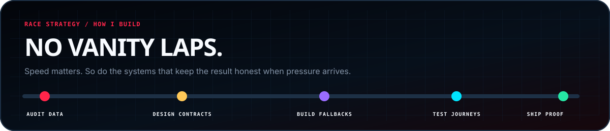
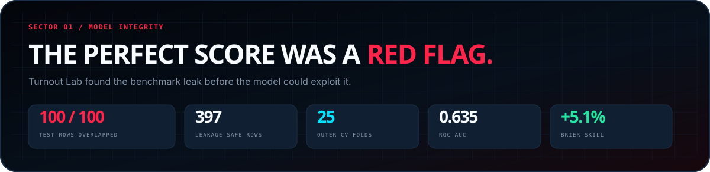
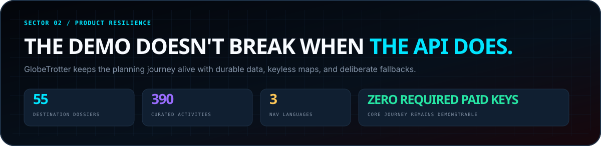
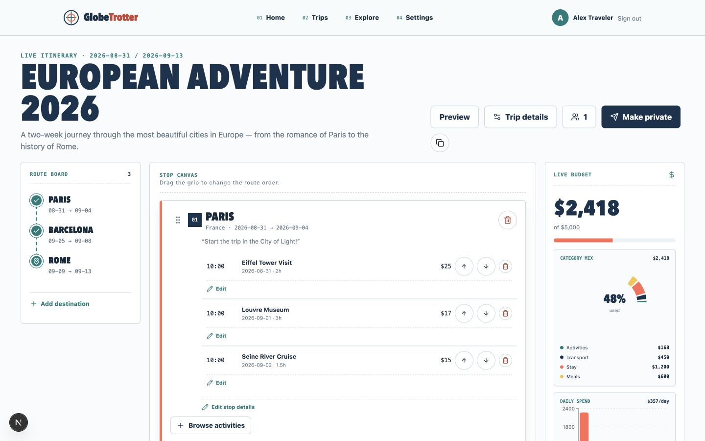
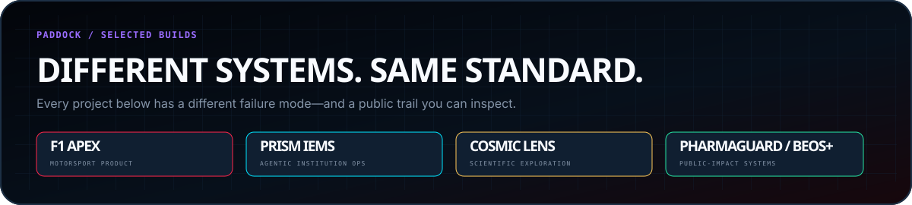
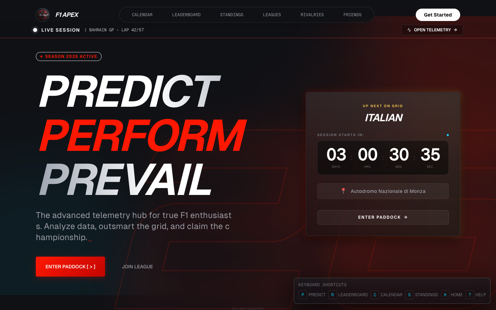
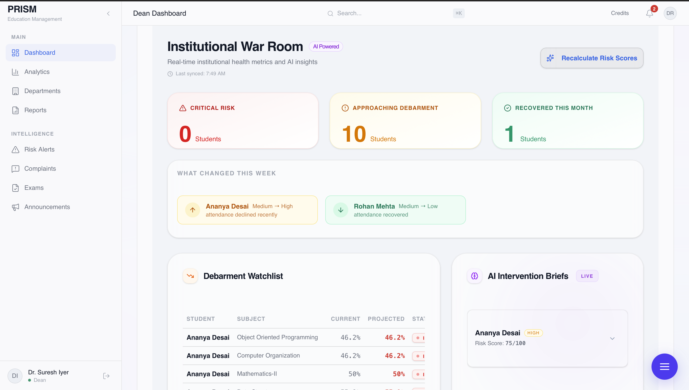
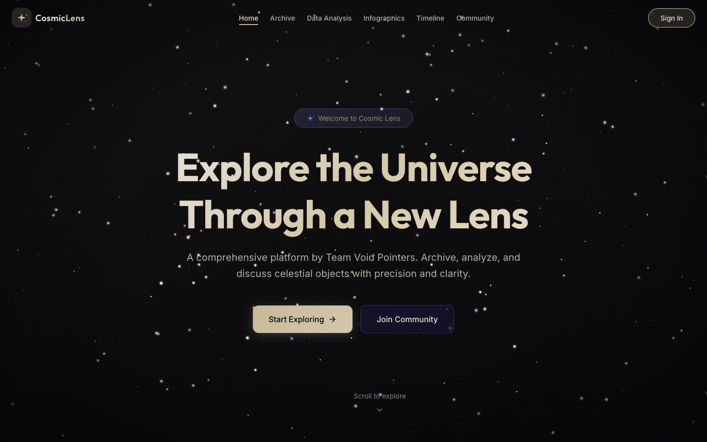
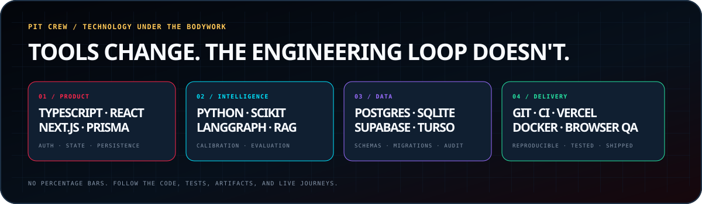

 

[**ENTER THE PADDOCK**](https://github.com/Abhichandani-Yash-Manish?tab=repositories) &nbsp;·&nbsp; [**OPEN F1 TELEMETRY**](https://apexpredict.live) &nbsp;·&nbsp; [**LINKEDIN**](https://in.linkedin.com/in/yash-abhichandani-dev) &nbsp;·&nbsp; [**TEAM RADIO**](mailto:yashraj2507@gmail.com)

I am happiest when the clock is running, the data is messy, and the system still has to work. That is probably why I like both **hackathons** and **Formula 1**.

I am **Yash**—a Computer Engineering student at Dharmsinh Desai University and a Data Science student at IIT Madras. I build full-stack products, applied ML systems, and agentic workflows. I care about the parts that usually get hidden after a demo: leaked data, access boundaries, fallback paths, calibrated uncertainty, and whether somebody else can actually run the repository.



 



### Turnout Lab // leakage-aware attendance forecasting

The obvious job was to train a classifier. The important discovery was that **all 100 official test records also appeared in training**. I quarantined test-linked identities and feature fingerprints before development, then used group-safe validation, fold-local preprocessing, calibration, threshold diagnostics, and reproducible artifacts.

`397 leakage-safe rows` · `25 outer folds` · `ROC-AUC 0.635` · `Macro-F1 0.584` · `Brier skill +5.1%`

[**OPEN CASE FILE →**](https://github.com/Abhichandani-Yash-Manish/turnout-lab) &nbsp; [Data audit](https://github.com/Abhichandani-Yash-Manish/turnout-lab#data-quality-audit) · [Evaluation](https://github.com/Abhichandani-Yash-Manish/turnout-lab#model-comparison-and-selection) · [Model card](https://github.com/Abhichandani-Yash-Manish/turnout-lab#model-card-and-responsible-use)

<strong>ENGINEER'S DEBRIEF / why this decision matters</strong>

 

A model trained against that official split could look exceptional while measuring memorization. The final system instead reports modest signal honestly, separates attendance probability from input reliability, prevents student IDs from entering the model, and frames no-show risk as a prompt for supportive reminders—not punishment.

The repository includes the audit, executed notebook, repeated out-of-fold diagnostics, deterministic tests, batch scoring, scenario analysis, privacy-aware operational logging, and the exact 100-row submission artifact.

 



<a href="https://globetrotter-vert-ten.vercel.app">
  
</a>

### GlobeTrotter // the trip survives the refresh

A collaborative workspace that turns a multi-city idea into a dated, costed itinerary that can be edited, checked, shared, published, and copied. The core journey stays demonstrable without paid services: persisted coordinates backstop routing, keyless maps keep geography visible, and dated offline references make currency limitations explicit.

`55 destination dossiers` · `390 activities` · `3 navigation languages` · `0 required paid API keys`

[**LAUNCH WORKSPACE →**](https://globetrotter-vert-ten.vercel.app) &nbsp; [Source](https://github.com/Abhichandani-Yash-Manish/GlobeTrotter) · [Architecture](https://github.com/Abhichandani-Yash-Manish/GlobeTrotter#architecture) · [Verification](https://github.com/Abhichandani-Yash-Manish/GlobeTrotter#verification)

<strong>ENGINEER'S DEBRIEF / what lives below the interface</strong>

 

Role-aware collaboration, invitation tokens, transactional trip copying, budget controls, trip-health checks, persistent SQLite/Turso storage, seeded editorial data, multilingual navigation, and explicit degraded modes. The deployment is part of the evidence; the interface is not a mockup.

 



<table>
  <tr>
    <td width="50%" valign="top">
      <a href="https://apexpredict.live"></a>
        
      <strong>F1 APEX // race weekend, engineered</strong> 
      Predictions, leagues, standings, rivalries, scoring, and telemetry-oriented interaction—wrapped in the product language that made me want to build it.  
      <a href="https://apexpredict.live"><strong>LIVE TELEMETRY →</strong></a> · <a href="https://github.com/Abhichandani-Yash-Manish/F1-Prefictor-Vibe_Project">SOURCE</a>
    </td>
    <td width="50%" valign="top">
      <a href="https://prism-iems.vercel.app"></a>
        
      <strong>PRISM IEMS // institution ops with guardrails</strong> 
      A role-based institutional system exploring observable agent workflows, intervention queues, approval boundaries, and evidence-aware operations.  
      <a href="https://prism-iems.vercel.app"><strong>OPEN WAR ROOM →</strong></a> · <a href="https://github.com/Abhichandani-Yash-Manish/prism-iems">SOURCE</a>
    </td>
  </tr>
  <tr>
    <td width="50%" valign="top">
      <a href="https://cosmiclens-iota.vercel.app"></a>
        
      <strong>COSMIC LENS // signal in the early universe</strong> 
      A team-built astronomy experience for archiving, analysing, visualising, and discussing high-redshift observations.  
      <a href="https://cosmiclens-iota.vercel.app"><strong>START EXPLORING →</strong></a> · <a href="https://github.com/Abhichandani-Yash-Manish/Cosmic-Lens-by-Team-Void_Pointers">SOURCE</a>
    </td>
    <td width="50%" valign="top">
       
      <code>PUBLIC IMPACT / DOUBLE HEADER</code>
      <h3>PharmaGuard</h3>
      
Pharmacy inventory workflows around FEFO dispatch, expiry visibility, alerts, and demand forecasting.

      <a href="https://github.com/Abhichandani-Yash-Manish/Void-Pointers-Aetrix-2026-"><strong>INSPECT PHARMAGUARD →</strong></a>
        
      <h3>BEOS+</h3>
      
A blood-emergency coordination prototype spanning hospital inventory, live emergency mapping, and donor-alert workflows.

      <a href="https://beos-plus.vercel.app"><strong>OPEN BEOS+ →</strong></a> · <a href="https://github.com/Abhichandani-Yash-Manish/BEOS_PLUS">SOURCE</a>
        
      <code>IN THE GARAGE</code>
      
<a href="https://github.com/Abhichandani-Yash-Manish/apex-simulate"><strong>APEX SIMULATE</strong></a> — strategy-simulation and telemetry-lake experiments.

      
<a href="https://github.com/Abhichandani-Yash-Manish/ClubAtlas"><strong>CLUBATLAS</strong></a> — a grounded campus-club assistant with safe action boundaries.

    </td>
  </tr>
</table>

 



The stack is not the personality. The decisions are. I use **TypeScript, React, Next.js, Python, scikit-learn, LangGraph, SQL, Supabase, Turso, Git, CI, Docker, and browser-level QA** when they earn their place in the system.

<strong>PIT WALL NOTES / how I work with a team</strong>

 

Hackathons taught me to move quickly. Engineering taught me what must remain after the chequered flag: a repository someone else can run, boundaries someone else can explain, a main journey that stays intact while features evolve, and limitations a reviewer does not have to discover by accident.

I like ambitious teams, small testable interfaces, clear ownership, honest demos, and the moment a wild idea becomes a system we can defend.

 



### Yash Abhichandani

Gujarat, India · Computer Engineering × Data Science · Formula 1 brain, engineering hands

[**EMAIL**](mailto:yashraj2507@gmail.com) &nbsp;·&nbsp; [**LINKEDIN**](https://in.linkedin.com/in/yash-abhichandani-dev) &nbsp;·&nbsp; [**ALL REPOSITORIES**](https://github.com/Abhichandani-Yash-Manish?tab=repositories)

Built under pressure. Explained after the chequered flag.

