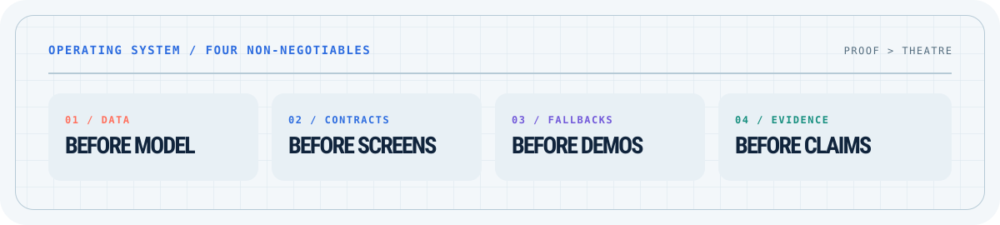
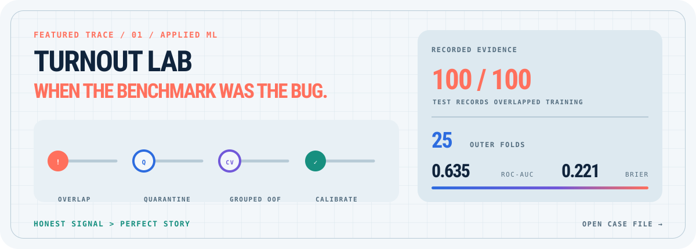
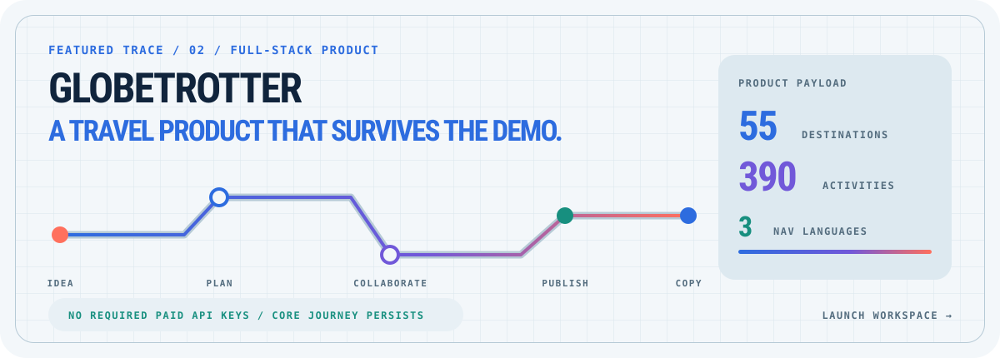
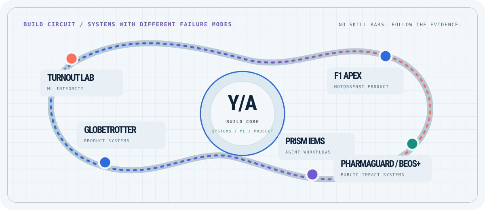
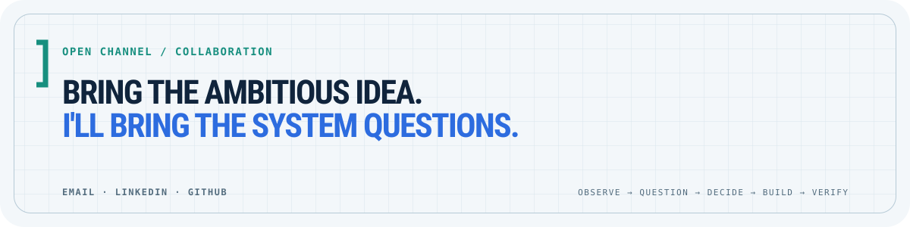

<picture>
  <source media="(prefers-color-scheme: dark)" srcset="./assets/hero-dark.svg">
  <source media="(prefers-color-scheme: light)" srcset="./assets/hero-light.svg">
  
</picture>

 

[EXPLORE SYSTEMS](https://github.com/Abhichandani-Yash-Manish?tab=repositories) · [LAUNCH GLOBETROTTER](https://globetrotter-vert-ten.vercel.app) · [LINKEDIN](https://in.linkedin.com/in/yash-abhichandani-dev) · [EMAIL](mailto:yashraj2507@gmail.com)

I am **Yash**, a Computer Engineering student at Dharmsinh Desai University and Data Science student at IIT Madras. I like the moment when a project stops being a demo and starts having consequences—a leaked split can lie, an access rule can expose data, and a planner can lose someone's work.

**That is the part I like engineering.**

<picture>
  <source media="(prefers-color-scheme: dark)" srcset="./assets/operating-system-dark.svg">
  <source media="(prefers-color-scheme: light)" srcset="./assets/operating-system-light.svg">
  
</picture>

## Featured traces

<picture>
  <source media="(prefers-color-scheme: dark)" srcset="./assets/turnout-trace-dark.svg">
  <source media="(prefers-color-scheme: light)" srcset="./assets/turnout-trace-light.svg">
  
</picture>

**[OPEN THE CASE FILE →](https://github.com/Abhichandani-Yash-Manish/turnout-lab)** &nbsp;&nbsp; [Evaluation](https://github.com/Abhichandani-Yash-Manish/turnout-lab#model-comparison-and-selection) · [Data audit](https://github.com/Abhichandani-Yash-Manish/turnout-lab#data-quality-audit) · [Model card](https://github.com/Abhichandani-Yash-Manish/turnout-lab#model-card-and-responsible-use)

<strong>Why this decision matters</strong>

 

The obvious task was to train an attendance classifier. The important discovery was that every official test record also appeared in training by student identity and normalized feature fingerprint. A conventional model could appear perfect while measuring memorization.

- **Decision:** quarantine every test-linked identity and fingerprint before evaluation.
- **Build:** group-safe nested validation, fold-local preprocessing, sigmoid calibration, risk bands, batch scoring, and an operational Streamlit dashboard.
- **Proof:** 25 outer validation folds, machine-readable audit artifacts, an executed notebook, deterministic tests, and a hard separation between evaluation and prediction refit.

The shipped result is deliberately honest: a calibrated random forest with modest signal, documented uncertainty, privacy boundaries, and prohibited punitive use.

 

<picture>
  <source media="(prefers-color-scheme: dark)" srcset="./assets/globetrotter-trace-dark.svg">
  <source media="(prefers-color-scheme: light)" srcset="./assets/globetrotter-trace-light.svg">
  
</picture>

**[LAUNCH THE WORKSPACE →](https://globetrotter-vert-ten.vercel.app)** &nbsp;&nbsp; [Source](https://github.com/Abhichandani-Yash-Manish/GlobeTrotter) · [Architecture](https://github.com/Abhichandani-Yash-Manish/GlobeTrotter#architecture) · [Verification](https://github.com/Abhichandani-Yash-Manish/GlobeTrotter#verification)

<strong>Why this system survives the demo</strong>

 

The product turns a multi-city idea into a dated, costed itinerary that can be edited with collaborators, checked for planning conflicts, published, and copied into an independent trip.

- **Constraint:** keep the judged journey demonstrable without paid services or required API keys.
- **Decision:** use a durable relational model, seeded editorial data, keyless maps, persisted-coordinate route fallbacks, and clearly dated offline currency references.
- **Build:** role-aware collaboration, invitation tokens, 55 destination dossiers, 390 city-specific activities, budget controls, trip-health checks, multilingual navigation, and transactional trip copying.
- **Proof:** public demo journeys, desktop and mobile screenshots, migrations, clean-data gates, access-control tests, deployment documentation, and a persistent Turso production path.

## Build circuit

<picture>
  <source media="(prefers-color-scheme: dark)" srcset="./assets/build-circuit-dark.svg">
  <source media="(prefers-color-scheme: light)" srcset="./assets/build-circuit-light.svg">
  
</picture>

[**TURNOUT LAB**](https://github.com/Abhichandani-Yash-Manish/turnout-lab) · [**GLOBETROTTER**](https://github.com/Abhichandani-Yash-Manish/GlobeTrotter) · [**PRISM IEMS**](https://github.com/Abhichandani-Yash-Manish/prism-iems) · [**PHARMAGUARD**](https://github.com/Abhichandani-Yash-Manish/Void-Pointers-Aetrix-2026-) · [**BEOS+**](https://beos-plus.vercel.app) · [**F1 APEX**](https://apexpredict.live) · [**COSMIC LENS**](https://cosmiclens-iota.vercel.app)

Each system probes a different failure mode:

- **Machine-learning integrity** — leakage, calibration, grouped evaluation, and decision thresholds.
- **Product systems** — persistence, authorization, collaborative state, resilient data, and real user journeys.
- **Agent workflows** — observable state, validation, controlled tools, and side-effect boundaries.
- **Public-impact systems** — pharmacy inventory and blood-emergency coordination.
- **Motorsport products** — deadline-aware predictions, competition, scoring, and telemetry-oriented interfaces.

## Under the bodywork

<strong>Capability map — tools connected to the work</strong>

 

- **Product systems:** TypeScript, React, Next.js, relational data models, Supabase, Prisma, Turso, and Firebase.
- **APIs and workflows:** Python, FastAPI, Flask, LangGraph, validation, background tasks, and event-driven updates.
- **Applied ML:** pandas, scikit-learn, grouped validation, calibration, feature pipelines, diagnostics, and Streamlit.
- **Delivery:** Git, CI, Vercel, Docker, reproducible environments, seeded demonstrations, and browser-level verification.

No skill percentages: follow the repositories, tests, artifacts, and live journeys instead.

<strong>Team protocol — what I try to leave behind</strong>

 

Hackathons taught me to move quickly. The harder lesson was learning what must remain after the deadline:

- a repository someone else can run;
- an architecture someone else can explain;
- explicit ownership and handoffs;
- a main journey that stays runnable while features evolve;
- limitations a reviewer does not have to discover by accident.

I enjoy teams that turn ambitious ideas into small, testable system boundaries and treat the demo as the beginning of scrutiny—not the end of engineering.

 

<picture>
  <source media="(prefers-color-scheme: dark)" srcset="./assets/open-channel-dark.svg">
  <source media="(prefers-color-scheme: light)" srcset="./assets/open-channel-light.svg">
  
</picture>

**Yash Abhichandani** 
Gujarat, India · Computer Engineering × Data Science

[EMAIL](mailto:yashraj2507@gmail.com) · [LINKEDIN](https://in.linkedin.com/in/yash-abhichandani-dev) · [GITHUB](https://github.com/Abhichandani-Yash-Manish?tab=repositories)

